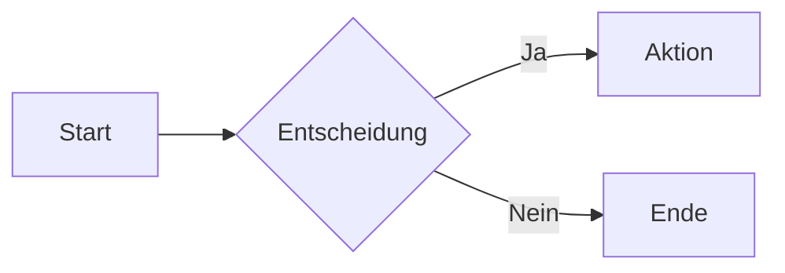

# GitHub Einführung & Cheatsheet

> Dein praktischer Einstieg in GitHub – von den Grundlagen bis zu GitHub Desktop, mit kompaktem Cheatsheet für den Alltag.

---

## Kapitel 1: Was ist GitHub?

### 1.1 Git vs. GitHub – der Unterschied

Bevor wir in GitHub eintauchen, ist es wichtig, den Unterschied zwischen Git und GitHub zu verstehen. Git ist ein Versionskontrollsystem, das Linus Torvalds 2005 entwickelt hat. Es läuft lokal auf deinem Computer und verfolgt Änderungen an Dateien. Du kannst damit verschiedene Versionen deines Codes speichern, zwischen ihnen wechseln und bei Bedarf zu älteren Ständen zurückkehren.

GitHub hingegen ist eine Plattform, die Git-Repositories im Internet hostet. Stell dir Git als die Engine vor und GitHub als die Werkstatt mit Showroom. GitHub fügt soziale und kollaborative Features hinzu: Du kannst Code mit anderen teilen, gemeinsam an Projekten arbeiten, Issues erstellen und Pull Requests einreichen.

| Aspekt | Git | GitHub |
|--------|-----|--------|
| **Was ist es?** | Versionskontrollsystem | Hosting-Plattform für Git-Repos |
| **Wo läuft es?** | Lokal auf deinem Computer | In der Cloud (Web) |
| **Hauptzweck** | Änderungen tracken | Zusammenarbeit ermöglichen |
| **Offline nutzbar?** | Ja | Nein (nur mit lokalem Clone) |
| **Kosten** | Kostenlos (Open Source) | Kostenlos + bezahlte Pläne |

### 1.2 Warum GitHub? Einsatzgebiete

GitHub hat sich als Standard für Softwareentwicklung etabliert, wird aber längst nicht mehr nur für Code genutzt. Die Plattform eignet sich für jeden, der Dateien versionieren und mit anderen teilen möchte.

**Typische Einsatzgebiete:**

- **Softwareentwicklung**: Code versionieren, zusammenarbeiten, CI/CD-Pipelines
- **Dokumentation**: Technische Docs, Wikis, Handbücher mit Markdown
- **Open Source**: Projekte veröffentlichen, Community aufbauen, Beiträge annehmen
- **Wissenschaft**: Forschungsdaten, Papers, reproduzierbare Analysen
- **Persönliches Portfolio**: Projekte zeigen, Profil aufbauen
- **Konfigurationen**: Dotfiles, System-Setups, Infrastructure as Code

### 1.3 Account und Grundeinrichtung

Um GitHub zu nutzen, brauchst du einen Account unter github.com. Die Registrierung ist kostenlos und gibt dir Zugang zu allen wesentlichen Features.

**Die wichtigsten Schritte nach der Registrierung:**

1. **Profil einrichten**: Füge ein Profilbild, Bio und ggf. eine Website hinzu
2. **E-Mail verifizieren**: Wichtig für Benachrichtigungen und Sicherheit
3. **Zwei-Faktor-Authentifizierung aktivieren**: Unter Settings → Password and authentication
4. **Git lokal konfigurieren**: Dein Name und E-Mail für Commits setzen

```bash
git config --global user.name "Dein Name"
git config --global user.email "deine@email.com"
```

### 1.4 Die GitHub-Oberfläche verstehen

Wenn du dich bei GitHub einloggst, landest du auf dem Dashboard. Hier siehst du einen Feed mit Aktivitäten von Repositories, denen du folgst, sowie deine eigenen Repos auf der linken Seite.

**Die wichtigsten Bereiche:**

| Bereich | Zugang | Inhalt |
|---------|--------|--------|
| **Dashboard** | github.com | Feed, deine Repos, Explore |
| **Profile** | github.com/username | Deine öffentlichen Repos, Contributions |
| **Repository** | github.com/user/repo | Code, Issues, Pull Requests, Settings |
| **Explore** | github.com/explore | Trending Repos, Topics, Collections |
| **Settings** | Profilmenü oben rechts | Account, Security, Notifications |

Die Navigation oben links führt dich zu Pull Requests, Issues und Discussions, an denen du beteiligt bist. Die Suchleiste durchsucht ganz GitHub – mit Filtern wie `user:`, `repo:`, `language:` kannst du die Suche eingrenzen.

---

## Kapitel 2: UI-Varianten – Wie du auf GitHub zugreifst

### 2.1 Überblick der Zugangswege

GitHub bietet verschiedene Interfaces für unterschiedliche Workflows und Vorlieben. Du bist nicht auf eine Variante beschränkt – die meisten Nutzer kombinieren mehrere je nach Situation.

| Variante | Typ | Ideal für | Offline-fähig |
|----------|-----|-----------|---------------|
| **GitHub.com** | Web | Browsing, Reviews, Settings | Nein |
| **github.dev** | Web-Editor | Schnelle Edits im Browser | Nein |
| **GitHub Desktop** | Desktop-App | Visuelles Git ohne CLI | Teilweise |
| **GitHub CLI** | Terminal | Power-User, Automatisierung | Teilweise |
| **GitHub Mobile** | Mobile App | Unterwegs, Notifications | Teilweise |
| **IDE-Integration** | Plugin | Entwicklung im Flow | Ja |

### 2.2 GitHub.com – Die Web-Oberfläche

Die Web-Oberfläche unter github.com ist der zentrale Anlaufpunkt. Hier erledigst du alles, was über reines Code-Schreiben hinausgeht.

**Stärken der Web-UI:**
- Repository-Einstellungen und Administration
- Pull Request Reviews mit Inline-Kommentaren
- Issues und Projects verwalten
- Team- und Organisations-Management
- Insights, Analytics und Security-Features
- Marketplace und Actions-Konfiguration

**Typische Aufgaben:**
- Code durchstöbern und verstehen
- Fremde Repositories forken
- Issues erstellen und kommentieren
- PRs reviewen und mergen
- Releases erstellen und verwalten

### 2.3 github.dev – Der Browser-Editor

Drücke auf jeder Repository-Seite die Taste `.` (Punkt) und GitHub öffnet einen vollwertigen VS Code-Editor im Browser. Die URL wechselt von `github.com` zu `github.dev`.

**Was github.dev kann:**
- Dateien bearbeiten mit Syntax-Highlighting
- Mehrere Dateien gleichzeitig öffnen
- Suchen und Ersetzen im gesamten Repo
- Extensions nutzen (eingeschränkt)
- Commits erstellen und pushen

**Was github.dev nicht kann:**
- Code ausführen oder debuggen
- Terminal nutzen
- Lokale Dateien einbinden

**Wann nutzen?**
Perfekt für schnelle Edits, Typo-Fixes, README-Updates oder wenn du keinen lokalen Clone hast. Für richtige Entwicklungsarbeit brauchst du eine lokale Umgebung.

### 2.4 GitHub Desktop – Die visuelle App

GitHub Desktop ist die offizielle Desktop-Anwendung für Windows und macOS. Sie macht Git visuell und zugänglich – ohne dass du Befehle tippen musst.

**Kernfunktionen:**
- Repositories klonen, erstellen, verwalten
- Änderungen committen mit visuellem Diff
- Branches erstellen, wechseln, mergen
- Pull Requests direkt erstellen
- Merge-Konflikte visuell lösen

**Für wen geeignet?**
- Einsteiger, die Git lernen wollen
- Entwickler, die visuelle Diffs bevorzugen
- Alle, die keine Lust auf Terminal haben

→ **Deep Dive in Kapitel 7: GitHub Desktop**

### 2.5 GitHub CLI – Power im Terminal

Die GitHub CLI (`gh`) bringt GitHub-Funktionen ins Terminal. Anders als `git` (das nur Versionskontrolle macht) interagiert `gh` direkt mit der GitHub-Plattform.

**Installation:**
```bash
# macOS
brew install gh

# Windows
winget install GitHub.cli

# Authentifizieren
gh auth login
```

**Beispiel-Befehle:**

| Befehl | Funktion |
|--------|----------|
| `gh repo clone user/repo` | Repository klonen |
| `gh repo create` | Neues Repo erstellen |
| `gh pr create` | Pull Request erstellen |
| `gh pr list` | Offene PRs anzeigen |
| `gh pr checkout 123` | PR lokal auschecken |
| `gh issue create` | Issue erstellen |
| `gh issue list` | Issues auflisten |
| `gh run list` | Actions-Runs anzeigen |
| `gh browse` | Repo im Browser öffnen |

**Wann nutzen?**
Wenn du sowieso im Terminal arbeitest und GitHub-Aktionen ohne Browser-Wechsel erledigen willst. Ideal auch für Scripting und Automatisierung.

### 2.6 GitHub Mobile – Für unterwegs

Die GitHub Mobile App (iOS und Android) ist kein Ersatz für Desktop-Arbeit, aber perfekt für unterwegs.

**Was du mobil gut machen kannst:**
- Notifications checken und verwalten
- Issues lesen und kommentieren
- PRs reviewen (Approve/Request Changes)
- Code durchstöbern
- Discussions folgen
- Schnelle Merges

**Was du besser am Desktop machst:**
- Code schreiben oder editieren
- Komplexe Reviews mit vielen Dateien
- Repository-Einstellungen ändern
- Actions-Workflows debuggen

### 2.7 IDE-Integrationen

Die meisten modernen IDEs haben eingebaute Git- und GitHub-Unterstützung. Du verlässt deine Entwicklungsumgebung nicht mehr.

**VS Code:**
- Eingebaute Git-Integration (Source Control Panel)
- GitHub Pull Requests Extension für PR-Reviews
- GitLens für erweiterte Git-Features
- GitHub Copilot für AI-Unterstützung

**JetBrains IDEs (IntelliJ, WebStorm, PyCharm):**
- Git-Integration im Hauptmenü
- GitHub-Plugin für PRs und Issues
- Diff-Viewer und Merge-Tool

**Weitere:**
- Xcode (Git eingebaut)
- Visual Studio (GitHub Extension)
- Neovim/Vim (Fugitive, Octo.nvim)

### 2.8 Welche Variante wann?

| Situation | Empfehlung |
|-----------|------------|
| Code browsen, Issues lesen | **Web UI** |
| Schneller Typo-Fix | **github.dev** (Taste `.`) |
| Tägliches Committen | **Desktop** oder **IDE** |
| PR erstellen nach Push | **CLI** (`gh pr create`) |
| Code Review | **Web UI** oder **IDE** |
| Unterwegs Notifications | **Mobile App** |
| Repo-Einstellungen | **Web UI** |
| Automatisierung/Scripting | **CLI** |
| Merge-Konflikte lösen | **Desktop** oder **IDE** |

Die meisten Entwickler nutzen eine Kombination: IDE für Code, Web für Reviews, CLI für schnelle Aktionen, Mobile für Notifications.

---

## Kapitel 3: User, Organisationen & Strukturen

### 3.1 Persönliche Accounts vs. Organisationen

GitHub unterscheidet zwischen zwei Arten von Accounts: persönliche Accounts und Organisationen. Beide können Repositories besitzen, aber sie dienen unterschiedlichen Zwecken.

**Persönlicher Account:**
Dein persönlicher Account ist deine Identität auf GitHub. Er gehört dir allein, und du bist der einzige Owner. Du kannst beliebig viele Repositories erstellen und andere Personen als Collaborators einladen. Für Einzelprojekte, persönliche Experimente oder dein Portfolio ist der persönliche Account perfekt.

**Organisation:**
Eine Organisation ist ein geteilter Account für Teams und Unternehmen. Sie hat keinen eigenen Login – stattdessen melden sich Mitglieder mit ihren persönlichen Accounts an. Organisationen bieten erweiterte Berechtigungsstrukturen, Team-Management und zentrale Abrechnung.

| Merkmal | Persönlicher Account | Organisation |
|---------|---------------------|--------------|
| **Eigentümer** | Eine Person | Mehrere Owner möglich |
| **Login** | Eigene Credentials | Via persönliche Accounts |
| **Teams** | Nicht verfügbar | Ja, mit Hierarchien |
| **Berechtigungen** | Einfach (Collaborators) | Granular (Teams + Rollen) |
| **Ideal für** | Einzelpersonen | Teams, Firmen, Communities |

### 3.2 Teams und Berechtigungen

Innerhalb einer Organisation kannst du Teams erstellen, um Berechtigungen effizient zu verwalten. Statt jeden User einzeln zu berechtigen, weist du Teams zu Repositories zu.

**Typische Team-Struktur:**

```
Organisation: meine-firma
├── Team: engineering
│   ├── frontend (nested)
│   └── backend (nested)
├── Team: design
└── Team: documentation
```

**Repository-Berechtigungen (Rollen):**

| Rolle | Rechte |
|-------|--------|
| **Read** | Code ansehen, Issues erstellen, Discussions |
| **Triage** | + Issues/PRs verwalten, Labels setzen |
| **Write** | + Code pushen, Branches erstellen |
| **Maintain** | + Repository-Einstellungen (ohne destruktive) |
| **Admin** | Volle Kontrolle inkl. Löschen |

### 3.3 Repositories vs. Projects – wann was nutzen?

Diese Unterscheidung verwirrt viele Einsteiger, denn beide Begriffe klingen ähnlich. Sie erfüllen aber völlig unterschiedliche Zwecke.

**Repository (Repo):**
Ein Repository ist ein Container für deinen Code und dessen Geschichte. Es enthält Dateien, Commits, Branches, Issues und Pull Requests. Das Repo ist der technische Ort, wo dein Projekt lebt.

**Project:**
Ein Project ist ein Planungswerkzeug – ein Kanban-Board oder eine Tabelle, um Arbeit zu organisieren. Projects können Issues und Pull Requests aus verschiedenen Repositories zusammenbringen. Sie sind für Projektmanagement gedacht, nicht für Code-Speicherung.

| Aspekt | Repository | Project |
|--------|------------|---------|
| **Zweck** | Code speichern & versionieren | Arbeit planen & tracken |
| **Inhalt** | Dateien, Commits, Branches | Issues, PRs, Notizen als Karten |
| **Scope** | In sich geschlossen | Kann mehrere Repos umfassen |
| **Analogie** | Ordner mit Dateien | Kanban-Board / Spreadsheet |
| **Beispiel** | `mein-projekt` Repo | "Q1 Roadmap" Board |

**Wann was nutzen?**
- Du willst Code speichern → **Repository**
- Du willst Aufgaben organisieren → **Project**
- Du hast ein Mono-Repo mit vielen Tasks → **Repo + zugehöriges Project**
- Du koordinierst Arbeit über mehrere Repos → **Organisation-level Project**

### 3.4 Sichtbarkeit: Public, Private, Internal

Jedes Repository hat eine Sichtbarkeitseinstellung, die bestimmt, wer darauf zugreifen kann.

| Sichtbarkeit | Wer kann sehen? | Verfügbar für |
|--------------|-----------------|---------------|
| **Public** | Jeder im Internet | Alle Accounts |
| **Private** | Nur eingeladene User | Alle Accounts |
| **Internal** | Alle Org-Mitglieder | Enterprise-Organisationen |

**Wichtig zu wissen:**
- Public Repos sind komplett öffentlich – auch der Commit-Verlauf
- Private Repos auf Free-Accounts können Collaborators haben
- Internal ist ideal für firmeninterne Open-Source-Kultur

---

## Kapitel 4: Repositories – Das Herzstück

### 4.1 Repository erstellen und klonen

Ein neues Repository erstellst du über den grünen "New"-Button auf deinem Dashboard oder unter github.com/new.

**Beim Erstellen wählst du:**
- **Name**: kurz, beschreibend, lowercase mit Bindestrichen (z.B. `mein-projekt`)
- **Beschreibung**: Optional, aber empfohlen
- **Sichtbarkeit**: Public oder Private
- **Initialisierung**: README, .gitignore, License hinzufügen

Um lokal damit zu arbeiten, klonst du das Repo auf deinen Computer:

```bash
# Via HTTPS
git clone https://github.com/username/repo-name.git

# Via SSH (empfohlen, erfordert SSH-Key-Setup)
git clone git@github.com:username/repo-name.git
```

Nach dem Klonen hast du einen Ordner mit dem Repo-Namen, der die komplette Git-Historie enthält.

### 4.2 README, LICENSE, .gitignore

Diese drei Dateien sollte jedes Repository haben – sie sind der Grundstein für ein professionelles Projekt.

**README.md:**
Die Visitenkarte deines Projekts. GitHub zeigt sie automatisch auf der Repo-Startseite an. Eine gute README enthält:
- Was das Projekt macht
- Wie man es installiert/nutzt
- Beispiele
- Wie man beitragen kann

**LICENSE:**
Definiert, was andere mit deinem Code machen dürfen. Ohne Lizenz gilt "All Rights Reserved". Häufige Lizenzen:

| Lizenz | Erlaubt | Bedingung |
|--------|---------|-----------|
| MIT | Fast alles | Copyright-Vermerk behalten |
| Apache 2.0 | Fast alles | + Patent-Grant |
| GPL v3 | Fast alles | Derivate müssen auch GPL sein |
| CC BY 4.0 | Für Nicht-Code | Namensnennung |

**.gitignore:**
Listet Dateien auf, die Git ignorieren soll – z.B. Build-Artefakte, Logs, Secrets. GitHub bietet Templates für verschiedene Sprachen.

```gitignore
# Beispiel .gitignore für Node.js
node_modules/
.env
*.log
dist/
```

### 4.3 Branches verstehen und nutzen

Branches sind parallele Entwicklungslinien. Der Standard-Branch heisst `main` (früher `master`). Für neue Features oder Bugfixes erstellst du eigene Branches.

**Warum Branches?**
- Der Main-Branch bleibt stabil
- Features können isoliert entwickelt werden
- Mehrere Personen arbeiten ohne Konflikte
- Einfaches Experimentieren ohne Risiko

```bash
# Neuen Branch erstellen und wechseln
git checkout -b feature/neue-funktion

# Alle Branches anzeigen
git branch -a

# Branch wechseln
git checkout main

# Branch löschen (lokal)
git branch -d feature/alte-funktion
```

**Typische Branch-Strategien:**

| Strategie | Branches | Ideal für |
|-----------|----------|-----------|
| **GitHub Flow** | main + feature branches | Einfache Projekte, Web-Apps |
| **Git Flow** | main, develop, feature, release, hotfix | Komplexe Release-Zyklen |
| **Trunk-Based** | main + sehr kurzlebige branches | CI/CD-intensive Teams |

### 4.4 Lokales Arbeiten mit Git-Basics

Der typische Workflow beim lokalen Arbeiten sieht so aus:

```bash
# 1. Aktuellen Stand holen
git pull origin main

# 2. Neuen Branch erstellen
git checkout -b feature/mein-feature

# 3. Dateien bearbeiten...

# 4. Änderungen stagen
git add .                    # Alle Änderungen
git add datei.txt           # Spezifische Datei

# 5. Commit erstellen
git commit -m "feat: Beschreibung der Änderung"

# 6. Zum Remote pushen
git push origin feature/mein-feature
```

**Wichtige Status-Befehle:**

```bash
git status          # Was ist geändert?
git diff            # Was genau wurde geändert?
git log --oneline   # Commit-Historie
```

---

## Kapitel 5: Zusammenarbeit auf GitHub

### 5.1 Issues erstellen und verwalten

Issues sind das Ticket-System von GitHub. Sie dienen zur Dokumentation von Bugs, Feature Requests, Fragen oder Aufgaben.

**Ein gutes Issue enthält:**
- Aussagekräftigen Titel
- Beschreibung des Problems oder Wunsches
- Schritte zur Reproduktion (bei Bugs)
- Screenshots oder Logs falls hilfreich
- Labels zur Kategorisierung

**Issue-Features:**

| Feature | Zweck |
|---------|-------|
| **Labels** | Kategorisierung (bug, enhancement, help wanted) |
| **Assignees** | Wer arbeitet daran? |
| **Milestone** | Zu welchem Release gehört es? |
| **Projects** | In welchem Board erscheint es? |
| **Linked PRs** | Welcher PR löst das Issue? |

**Issue-Referenzen:**
Du kannst Issues überall referenzieren mit `#123`. GitHub verlinkt automatisch. Mit Keywords wie `closes #123` oder `fixes #123` im PR schliesst sich das Issue beim Merge.

### 5.2 Pull Requests – der Workflow

Ein Pull Request (PR) ist ein Vorschlag, Änderungen von einem Branch in einen anderen zu mergen. PRs sind das zentrale Kollaborations-Tool auf GitHub.

**Der typische PR-Workflow:**

1. **Branch erstellen** und Änderungen committen
2. **PR öffnen** auf GitHub (Compare & pull request)
3. **Beschreibung** schreiben: Was, warum, wie testen?
4. **Review anfordern** von Teammitgliedern
5. **Feedback einarbeiten** (weitere Commits)
6. **Approval** erhalten
7. **Merge** durchführen

**PR-Best-Practices:**
- Kleine, fokussierte PRs sind besser als riesige
- Aussagekräftiger Titel und Beschreibung
- Screenshots/GIFs für UI-Änderungen
- Tests hinzufügen oder aktualisieren
- Draft PRs für Work-in-Progress nutzen

### 5.3 Code Reviews durchführen

Reviews sind essentiell für Codequalität und Wissenstransfer. Als Reviewer schaust du dir die Änderungen an und gibst Feedback.

**Review-Aktionen:**

| Aktion | Bedeutung |
|--------|-----------|
| **Comment** | Allgemeines Feedback, kein Approval/Block |
| **Approve** | Änderungen sind gut, kann gemergt werden |
| **Request Changes** | Blockt den PR, Anpassungen nötig |

**Gutes Review-Feedback:**
- Konstruktiv und respektvoll
- Konkret: Was soll geändert werden?
- Erkläre das "Warum" bei Vorschlägen
- Unterscheide zwischen Must-Fix und Nice-to-have
- Lobe guten Code explizit

**Review-Features auf GitHub:**
- Inline-Kommentare direkt im Diff
- Suggestions mit Code-Vorschlägen (können direkt übernommen werden)
- Threaded Discussions für längere Diskussionen

### 5.4 Merge-Konflikte lösen

Merge-Konflikte entstehen, wenn Git nicht automatisch entscheiden kann, welche Änderungen gelten sollen – typischerweise wenn zwei Personen dieselbe Zeile bearbeitet haben.

**Konflikt-Markierungen:**

```
<<<<<<< HEAD
Deine lokale Änderung
=======
Änderung vom anderen Branch
>>>>>>> feature/anderer-branch
```

**Konflikte lösen:**

1. **Konflikt-Dateien identifizieren**: `git status` zeigt sie an
2. **Dateien öffnen** und Konflikte manuell lösen
3. **Markierungen entfernen** und gewünschten Code behalten
4. **Gelöste Dateien stagen**: `git add <datei>`
5. **Merge committen**: `git commit`

**Tipps zur Vermeidung:**
- Regelmässig vom Main-Branch pullen
- Kleine, häufige Commits
- Kommunikation im Team bei gleichen Dateien

---

## Kapitel 6: GitHub-Features für Fortgeschrittene

### 6.1 GitHub Actions (CI/CD Basics)

GitHub Actions ist die integrierte CI/CD-Plattform. Du definierst Workflows in YAML-Dateien, die bei bestimmten Events automatisch ausgeführt werden.

**Workflow-Datei-Struktur (`.github/workflows/ci.yml`):**

```yaml
name: CI Pipeline

on:
  push:
    branches: [main]
  pull_request:
    branches: [main]

jobs:
  test:
    runs-on: ubuntu-latest
    steps:
      - uses: actions/checkout@v4
      - name: Setup Node
        uses: actions/setup-node@v4
        with:
          node-version: '20'
      - run: npm ci
      - run: npm test
```

**Wichtige Konzepte:**

| Konzept | Beschreibung |
|---------|--------------|
| **Workflow** | Eine YAML-Datei mit automatisierten Prozessen |
| **Event/Trigger** | Was löst den Workflow aus? (push, PR, schedule) |
| **Job** | Eine Gruppe von Steps, läuft auf einem Runner |
| **Step** | Einzelne Aktion (Befehl oder Action) |
| **Action** | Wiederverwendbare Bausteine (actions/checkout) |

### 6.2 GitHub Pages (statische Websites)

Mit GitHub Pages kannst du statische Websites direkt aus einem Repository hosten – kostenlos.

**Einrichtung:**
1. Repository Settings → Pages
2. Source wählen: Branch (z.B. `main`) und Ordner (`/` oder `/docs`)
3. Speichern – die Seite ist unter `username.github.io/repo-name` erreichbar

**Typische Anwendungen:**
- Projekt-Dokumentation
- Persönliche Portfolio-Websites
- Blog mit Jekyll oder anderen Static Site Generators
- Präsentationen

**Spezial-Repository:**
Ein Repo namens `username.github.io` wird automatisch unter dieser URL gehostet – ideal für deine persönliche Website.

### 6.3 Projects (Projektmanagement-Boards)

GitHub Projects (in der neuen Version "Projects V2") bietet flexible Projektmanagement-Tools direkt in GitHub.

**Ansichten:**

| Ansicht | Ideal für |
|---------|-----------|
| **Board** | Kanban-Style mit Spalten (To Do, In Progress, Done) |
| **Table** | Spreadsheet-artig mit Custom Fields |
| **Roadmap** | Timeline-Ansicht für Planung |

**Features:**
- Custom Fields (Status, Priority, Iteration, etc.)
- Automatisierung (z.B. Status ändern bei PR-Merge)
- Mehrere Repos in einem Project
- Filter und gruppierte Ansichten

**Project erstellen:**
1. Profil oder Organisation → Projects → New project
2. Template wählen oder leer starten
3. Issues/PRs hinzufügen (manuell oder mit Automatisierung)

### 6.4 Discussions und Wikis

**Discussions:**
Ein Forum-artiger Bereich für Fragen, Ideen und Community-Austausch. Anders als Issues sind Discussions für offene Gespräche gedacht, nicht für trackbare Tasks.

Kategorien wie "Q&A", "Ideas", "Show and Tell" strukturieren die Diskussionen. Antworten können als "Accepted Answer" markiert werden.

**Wiki:**
Jedes Repository kann ein Wiki haben – ideal für ausführliche Dokumentation, die über eine README hinausgeht.

- Eigene Git-History (kann separat geklont werden)
- Markdown-basiert mit Sidebar-Navigation
- Kann auf bestimmte User beschränkt werden

| Feature | Discussions | Wiki |
|---------|-------------|------|
| **Zweck** | Community-Austausch | Dokumentation |
| **Format** | Posts und Antworten | Seiten mit Navigation |
| **Durchsuchbar** | Ja | Ja |
| **Ideal für** | Q&A, Feedback, Ideas | Guides, Tutorials, Reference |

---

## Kapitel 7: GitHub Desktop

In Kapitel 2 hast du einen Überblick über alle UI-Varianten erhalten. Hier tauchen wir tief in GitHub Desktop ein – die ideale Wahl für alle, die Git visuell nutzen möchten.

### 7.1 Installation und Einrichtung

GitHub Desktop ist die offizielle GUI-Anwendung für Git und GitHub. Sie vereinfacht den Umgang mit Repositories ohne Kommandozeile.

**Installation:**
1. Download von desktop.github.com
2. Installieren und starten
3. Mit GitHub-Account anmelden (Authorize via Browser)
4. Git-Konfiguration wird automatisch übernommen

**Erste Schritte nach der Installation:**
- Bestehende lokale Repos hinzufügen (File → Add Local Repository)
- GitHub-Repos klonen (File → Clone Repository)
- Neues Repo erstellen (File → New Repository)

### 7.2 Repositories verwalten ohne Kommandozeile

Die Hauptansicht von GitHub Desktop zeigt links deine Repositories und rechts den aktuellen Stand.

**Tägliche Aufgaben:**

| Aufgabe | In GitHub Desktop |
|---------|-------------------|
| **Änderungen sehen** | Changes-Tab zeigt Diff |
| **Committen** | Summary eingeben → Commit to branch |
| **Pushen** | Push origin (oben rechts) |
| **Pullen** | Fetch origin → Pull |
| **Branch wechseln** | Current Branch Dropdown |
| **Historie ansehen** | History-Tab |

**Vorteile der GUI:**
- Visueller Diff mit Syntax-Highlighting
- Einfaches Stagen einzelner Zeilen oder Hunks
- Übersichtliche Branch-Auswahl
- Klare Anzeige von Sync-Status

### 7.3 Commits, Branches und Pull Requests in der GUI

**Committen:**
1. Änderungen im Changes-Tab ansehen
2. Dateien zum Commit auswählen (Checkboxen)
3. Summary (Pflicht) und Description (optional) eingeben
4. "Commit to [branch]" klicken

**Branching:**
- Neuer Branch: Branch → New Branch
- Branch wechseln: Dropdown "Current Branch"
- Branch mergen: Branch → Merge into Current Branch
- Branch auf GitHub erstellen: Publish branch

**Pull Request erstellen:**
Nach dem Pushen erscheint ein Banner "Create Pull Request". Klicken öffnet GitHub im Browser mit vorausgefülltem PR-Formular.

### 7.4 Wann Desktop vs. CLI vs. Web?

Jedes Tool hat seine Stärken. Die beste Wahl hängt von der Aufgabe und deinen Vorlieben ab.

| Aufgabe | Empfehlung | Warum |
|---------|------------|-------|
| **Tägliches Committen** | Desktop | Schnell, visuell, übersichtlich |
| **Komplexe Git-Operationen** | CLI | Mehr Kontrolle (rebase, cherry-pick) |
| **Code Review** | Web | Inline-Kommentare, Discussions |
| **Repository-Einstellungen** | Web | Nur dort verfügbar |
| **Merge-Konflikte** | Desktop oder IDE | Visuelle Diff-Tools helfen |
| **Schnelles Nachschlagen** | Web | Immer verfügbar, kein Setup |
| **Automatisierung/Scripting** | CLI | Integrierbar in Scripts |

**Empfehlung für Einsteiger:**
Starte mit GitHub Desktop für den Alltag. Lerne parallel die wichtigsten CLI-Befehle (`status`, `add`, `commit`, `push`, `pull`). Die Web-Oberfläche nutzt du für Reviews, Issues und Settings. Mit der Zeit entwickelst du ein Gefühl dafür, welches Tool wann am effizientesten ist.

---

# GitHub Cheatsheet

## Seite 1: Git-Befehle Essentials

### Die 20 wichtigsten Git-Commands

| Befehl | Beschreibung |
|--------|--------------|
| `git init` | Neues Repository initialisieren |
| `git clone <url>` | Repository klonen |
| `git status` | Aktuellen Status anzeigen |
| `git add <datei>` | Datei zum Staging hinzufügen |
| `git add .` | Alle Änderungen stagen |
| `git commit -m "msg"` | Commit mit Nachricht erstellen |
| `git push` | Commits zum Remote pushen |
| `git pull` | Änderungen vom Remote holen |
| `git fetch` | Remote-Status aktualisieren (ohne merge) |
| `git branch` | Branches auflisten |
| `git branch <n>` | Neuen Branch erstellen |
| `git checkout <branch>` | Branch wechseln |
| `git checkout -b <n>` | Branch erstellen und wechseln |
| `git merge <branch>` | Branch in aktuellen mergen |
| `git log --oneline` | Kompakte Commit-Historie |
| `git diff` | Ungestagete Änderungen anzeigen |
| `git stash` | Änderungen temporär speichern |
| `git stash pop` | Gestashte Änderungen wiederherstellen |
| `git reset HEAD~1` | Letzten Commit rückgängig (behält Änderungen) |
| `git remote -v` | Remote-URLs anzeigen |

### Branching-Befehle

```bash
# Branch erstellen und wechseln
git checkout -b feature/neues-feature

# Remote Branch auschecken
git checkout -b feature/x origin/feature/x

# Branch löschen (lokal)
git branch -d branch-name

# Branch löschen (remote)
git push origin --delete branch-name

# Alle Branches (lokal + remote)
git branch -a
```

### Undo-Operationen

```bash
# Letzte Commit-Message ändern
git commit --amend -m "Neue Message"

# Datei aus Staging entfernen
git reset HEAD <datei>

# Lokale Änderungen verwerfen
git checkout -- <datei>

# Zum letzten Commit zurück (VORSICHT: löscht Änderungen!)
git reset --hard HEAD

# Commit rückgängig (neuer Reverse-Commit)
git revert <commit-hash>
```

---

## Seite 2: GitHub-Workflow

### Fork → Clone → Branch → Commit → Push → PR

```
1. FORK        Repository auf GitHub forken (Button oben rechts)
                ↓
2. CLONE       git clone git@github.com:DEIN-USER/repo.git
                ↓
3. UPSTREAM    git remote add upstream git@github.com:ORIGINAL/repo.git
                ↓
4. BRANCH      git checkout -b feature/meine-änderung
                ↓
5. CODE        Änderungen machen...
                ↓
6. COMMIT      git add . && git commit -m "feat: Beschreibung"
                ↓
7. PUSH        git push origin feature/meine-änderung
                ↓
8. PR          Auf GitHub: "Compare & pull request"
```

### Issue-Lifecycle

```
┌─────────────┐
│   OPEN      │ ← Issue erstellt
└─────┬───────┘
      │ Assignee zugewiesen, Labels gesetzt
      ▼
┌─────────────┐
│ IN PROGRESS │ ← Jemand arbeitet daran
└─────┬───────┘
      │ PR erstellt mit "fixes #123"
      ▼
┌─────────────┐
│   CLOSED    │ ← PR gemergt oder manuell geschlossen
└─────────────┘
```

### Review-Prozess

| Schritt | Aktion |
|---------|--------|
| 1. PR öffnen | Beschreibung, Reviewers zuweisen |
| 2. CI läuft | Automatische Tests, Linting |
| 3. Review | Reviewer prüft Code, gibt Feedback |
| 4. Iteration | Autor arbeitet Feedback ein |
| 5. Approval | Reviewer approved |
| 6. Merge | Squash, Merge oder Rebase |
| 7. Cleanup | Branch löschen |

**Review-Kommentar-Syntax:**
```markdown
```suggestion
Verbesserter Code hier
```
→ Kann vom Autor mit einem Klick übernommen werden
```

---

## Seite 3: GitHub Markdown

### Formatierung und Syntax

| Syntax | Ergebnis |
|--------|----------|
| `**fett**` | **fett** |
| `*kursiv*` | *kursiv* |
| `~~durchgestrichen~~` | ~~durchgestrichen~~ |
| `` `code` `` | `code` |
| `[Link](url)` | Klickbarer Link |
| `` | Bild einbetten |
| `> Zitat` | Blockquote |
| `---` | Horizontale Linie |

### Überschriften und Listen

```markdown
# H1
## H2
### H3

- Ungeordnete Liste
- Noch ein Punkt
  - Eingerückt

1. Nummerierte Liste
2. Zweiter Punkt
```

### Task Lists und Mentions

```markdown
- [ ] Offene Aufgabe
- [x] Erledigte Aufgabe

@username         → Person erwähnen
#123              → Issue/PR verlinken
@org/team-name    → Team erwähnen
```

### Code-Blöcke und Diagramme

````markdown
```javascript
const greeting = "Hallo Welt";
console.log(greeting);
```


````

### Tabellen

```markdown
| Spalte 1 | Spalte 2 | Spalte 3 |
|----------|:--------:|---------:|
| Links    | Zentriert| Rechts   |
| Text     | Text     | Text     |
```

### Spezielle GitHub-Features

```markdown
<details>
<summary>Klick zum Aufklappen</summary>

Versteckter Inhalt hier.

</details>

> [!NOTE]
> Hinweis-Box

> [!WARNING]
> Warnung-Box
```

---

## Seite 4: Shortcuts & Best Practices

### Keyboard Shortcuts auf GitHub (Web)

| Shortcut | Aktion |
|----------|--------|
| `.` | Web-Editor öffnen (github.dev) |
| `t` | Datei-Finder öffnen |
| `w` | Branch-Wechsler öffnen |
| `s` oder `/` | Suche fokussieren |
| `g` + `n` | Zu Notifications |
| `g` + `c` | Zu Code |
| `g` + `i` | Zu Issues |
| `g` + `p` | Zu Pull Requests |
| `?` | Alle Shortcuts anzeigen |

**Im Code-Viewer:**

| Shortcut | Aktion |
|----------|--------|
| `l` | Zu Zeile springen |
| `b` | Blame-Ansicht |
| `y` | Permalink zur aktuellen Revision |

### Naming Conventions

| Element | Konvention | Beispiel |
|---------|------------|----------|
| **Repository** | lowercase, kebab-case | `mein-projekt` |
| **Branch** | prefix/beschreibung | `feature/user-login` |
| **Branch-Prefixe** | feature/, bugfix/, hotfix/, docs/ | `bugfix/fix-header` |
| **Tags** | Semantic Versioning | `v1.2.3` |

### Commit-Message-Standards (Conventional Commits)

```
<type>(<scope>): <beschreibung>

[optionaler body]

[optionaler footer]
```

**Types:**

| Type | Verwendung |
|------|------------|
| `feat` | Neues Feature |
| `fix` | Bugfix |
| `docs` | Nur Dokumentation |
| `style` | Formatierung (kein Code-Change) |
| `refactor` | Code-Umbau ohne Funktionsänderung |
| `test` | Tests hinzufügen/ändern |
| `chore` | Build, Dependencies, Config |

**Beispiele:**
```
feat(auth): add login with Google
fix(api): handle null response in user endpoint
docs: update README installation steps
refactor(utils): simplify date formatting
```

### Do's und Don'ts

| ✓ Do | ✗ Don't |
|------|---------|
| Kleine, fokussierte Commits | Riesige Commits mit vielen Änderungen |
| Aussagekräftige Messages | "fix", "update", "changes" |
| PRs zeitnah reviewen | PRs wochenlang liegen lassen |
| Konflikte lokal lösen | Force-Push auf shared Branches |
| .gitignore nutzen | Secrets/Credentials committen |
| Branch Protection aktivieren | Direkt auf main pushen |

### Nützliche Ressourcen

| Ressource | URL |
|-----------|-----|
| GitHub Docs | docs.github.com |
| Git Reference | git-scm.com/docs |
| GitHub Skills | skills.github.com |
| GitHub CLI | cli.github.com |
| GitHub Status | githubstatus.com |

---

*Erstellt für den praktischen Einsatz | Version 1.0 | Januar 2025*
